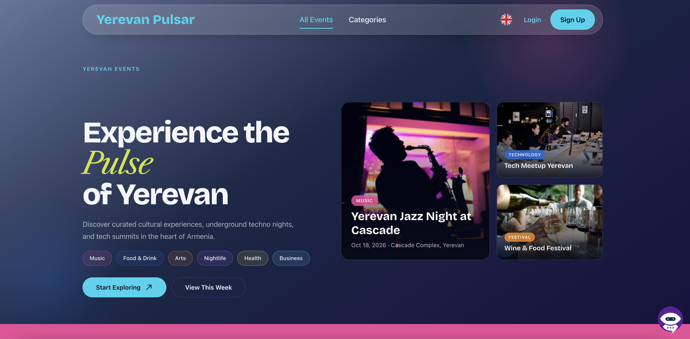
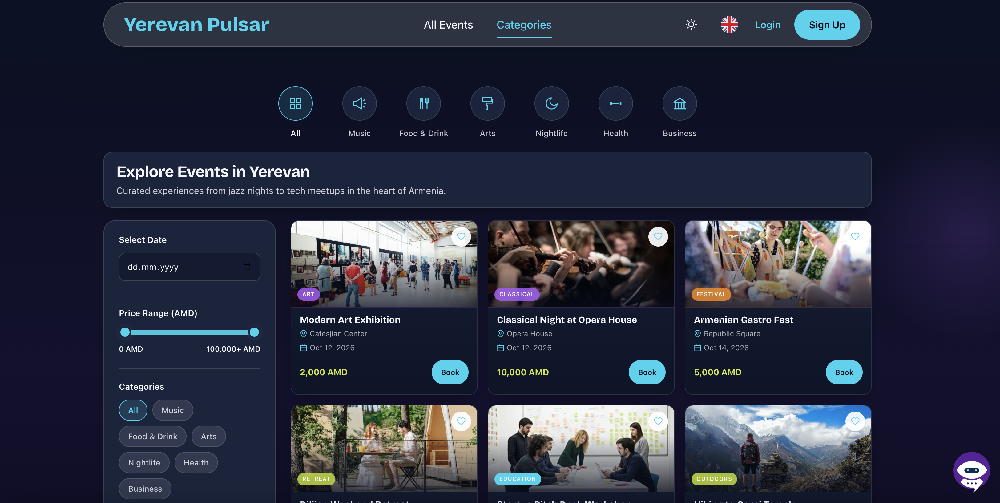
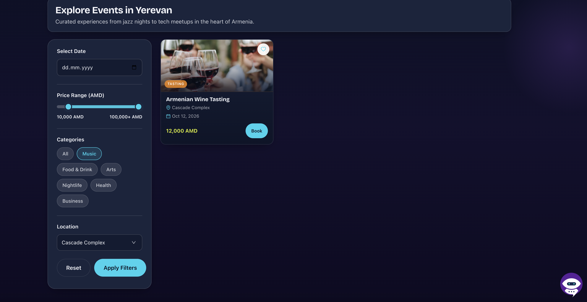
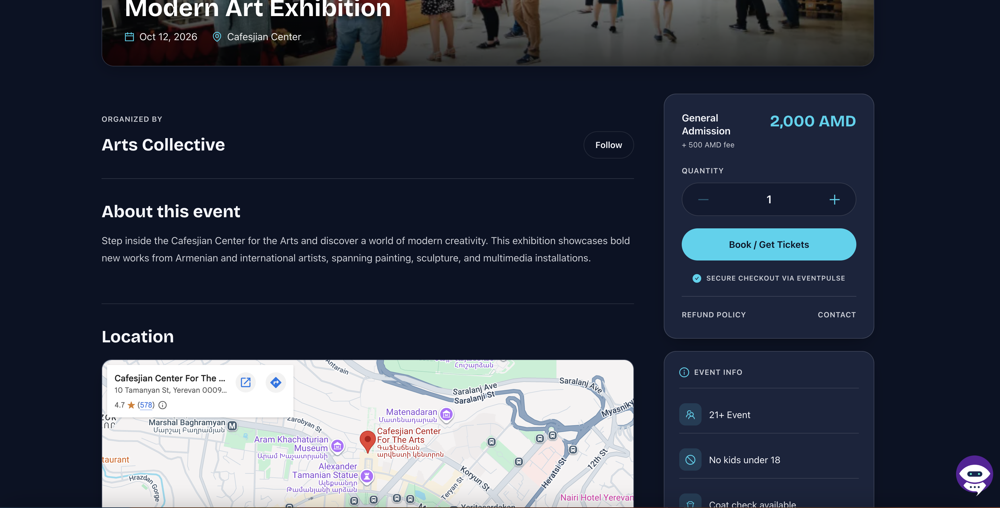
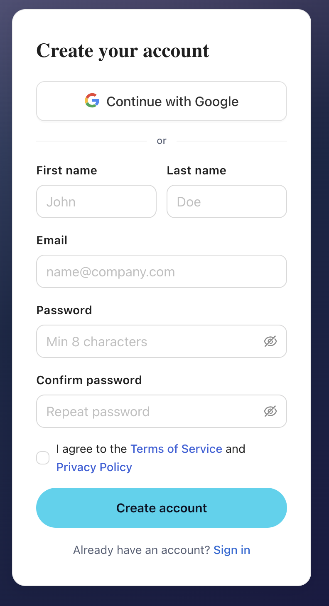
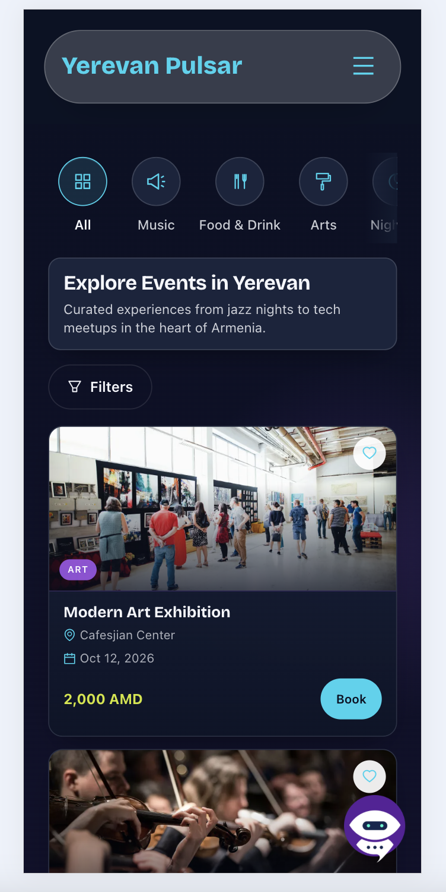

# Yerevan Pulsar — Events Platform

Discover, explore, and book events in Yerevan. Yerevan Pulsar is a React web app with authentication, event browsing, checkout, an admin panel, multi-language support, and an AI schedule assistant powered by Google Gemini.

---

## Screenshots

### Homepage



### Event listing



### Filters



### Event details



### Booking


### Registration



### Mobile



---

## Features

- **Event discovery** — Home hero, categories, and event detail pages
- **Auth** — Sign up, login, password recovery (Firebase Auth)
- **Booking & checkout** — Protected checkout flow for tickets
- **User profile** — Favorites, bookings, and profile data
- **Admin** — Registrations dashboard (more admin sections coming soon)
- **AI assistant** — Chat about schedules and events via Gemini (`/api/gemini/chat`)
- **i18n** — English, Armenian, and Russian
- **Telegram notifications** — Optional order alerts (client `VITE_TELEGRAM_*` vars)

---

## Tech stack

| Area | Tools |
|------|--------|
| UI | React 18, TypeScript, Vite 6, Ant Design |
| State | Redux Toolkit |
| Routing | React Router 7 |
| Auth / data | Firebase |
| i18n | i18next / react-i18next |
| AI | Google Gemini (Vercel serverless + local Vite plugin) |
| Deploy | Vercel |
| Tests | Jest, Testing Library, Playwright |

---

## Getting started

### Prerequisites

- Node.js **18+**
- **pnpm** (this repo uses `pnpm-lock.yaml`)

### Install

```bash
pnpm install
```

### Environment

Copy the example env file and fill in your values:

```bash
cp .env.example .env.local
```

| Variable | Where used | Notes |
|----------|------------|--------|
| `VITE_FIREBASE_*` | Client | Firebase Web app config |
| `VITE_TELEGRAM_BOT` | Client | Optional Telegram bot token |
| `VITE_TELEGRAM_CHAT_ID` | Client | Optional Telegram chat ID |
| `GEMINI_API_KEY` | Server only | **Do not** prefix with `VITE_` |
| `GEMINI_MODEL` | Server only | Default: `gemini-2.5-flash` |

### Run locally

```bash
pnpm dev
```

Open the URL Vite prints (usually `http://localhost:5173`).

The local Gemini chat API is served by the Vite plugin and uses the same handlers as production (`api/gemini`).

### Build

```bash
pnpm build
pnpm preview
```

---

## Scripts

| Command | Description |
|---------|-------------|
| `pnpm dev` | Start Vite dev server |
| `pnpm build` | Typecheck + production build |
| `pnpm preview` | Preview production build |
| `pnpm lint` | ESLint |
| `pnpm format` | Prettier (`src`) |
| `pnpm test` | Jest unit tests |
| `pnpm test:e2e` | Playwright e2e tests |

---

## Project structure (high level)

```text
src/
  components/     # UI (features, layout, shared)
  pages/          # Route composition layers
  providers/      # Router, Redux, etc.
  services/       # API clients (e.g. schedule assistant)
  store/          # Redux slices
  locales/        # i18n JSON
api/
  gemini/         # Vercel serverless Gemini chat API
server/
  gemini/         # Local Vite middleware for /api/gemini
public/
  screenshots/    # README screenshots live here
```

---

## Deploy on Vercel

1. Import the GitHub repository into Vercel.
2. Framework: **Vite** · Output: **dist** · Build: `pnpm build`.
3. Add the same environment variables as in `.env.example` (Production / Preview).
4. Redeploy after changing any `VITE_*` variable (they are baked in at build time).
5. Add your Vercel domain under Firebase **Authentication → Authorized domains**.

Serverless route: `POST /api/gemini/chat` (see `vercel.json`).

---

## License

Private project — all rights reserved unless otherwise noted.
